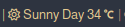

<h1 align="center">Weather Module For Polybar</h1>

# Description
This Polybar plugin uses OpenWeather API to get and display information about the current weather like the temprate and condition. The temprature is shown in numericals while the condition is shown through color and icons.

This module is easily customizable. All you need to do is modify the shell script `getweather.sh`.

## Table Of Contents
- [Dependencies](#dependencies)
- [Installation](#installation)
- [Customization](#customization)
- [Contribiuting](#contributing)

<a id="dependencies"></a>
# Dependencies
- [Nerd Fonts](https://github.com/ryanoasis/nerd-fonts)
- [jq](https://stedolan.github.io/jq)

<a id="installation"></a>
# Installation
1 - Get your own openweather api key. If you don’t know how to, refer to this [article](https://openweathermap.org/appid).  
2 - Get the city code of the city whose weather details you want. You can do thasearching the city on openweather.org and copying the digits after `.../city/`.  
3 - Make a plain text file called .env in your home directory.  
4 - Put the API key and city code in the text file. eg.  
```
API_KEY="yourAPIkey"
CITY_ID="yourCityCode"
```
5 - Make the script executable by `chmod + x /path/to/the/script`  
6 - Put this in your polybar config.ini  
```
[module/weather]
type     = custom/script
exec     = /path/to/the/script
tail     = false
interval = 100
```
7 - Add the module to your bar’s modules.

<a id="customization"></a>
# Customization
## Units
You can customize the units by changing the value of UNITS in the script. Possible values are metric, imperial and kelvin.
## Icons
You can change the icons for the different weather conditions by changing the ICON variable in the script.
## Colors
You can change the colors for the different weather conditions by changing the ICON_HEX variable in the script.
## Conditions
You can change the conditions of the different icon codes by changing the values of the CONDITION and DAYTIME variables.

<a id="contributing"></a>
# Contributing
If you want to add some features or want to fix a mistake, feel free to open a pull request.
